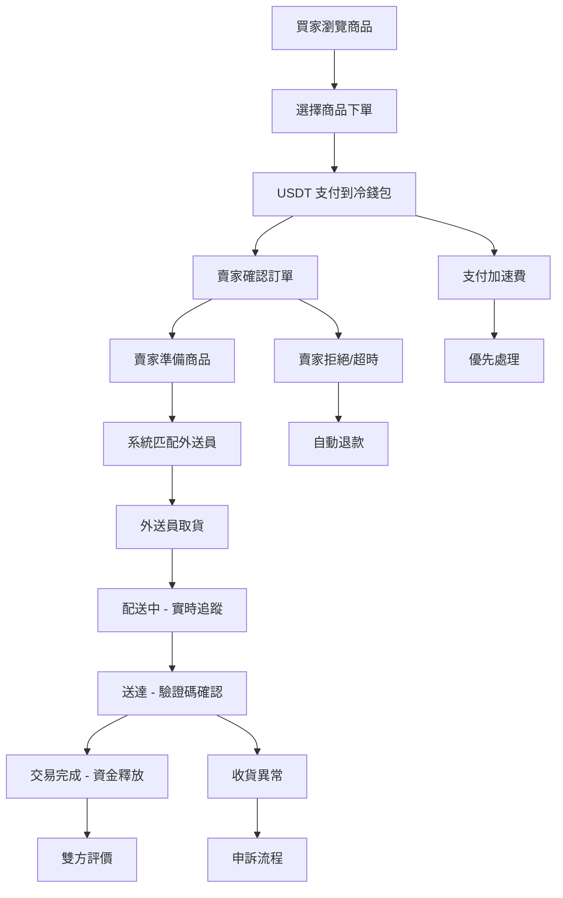
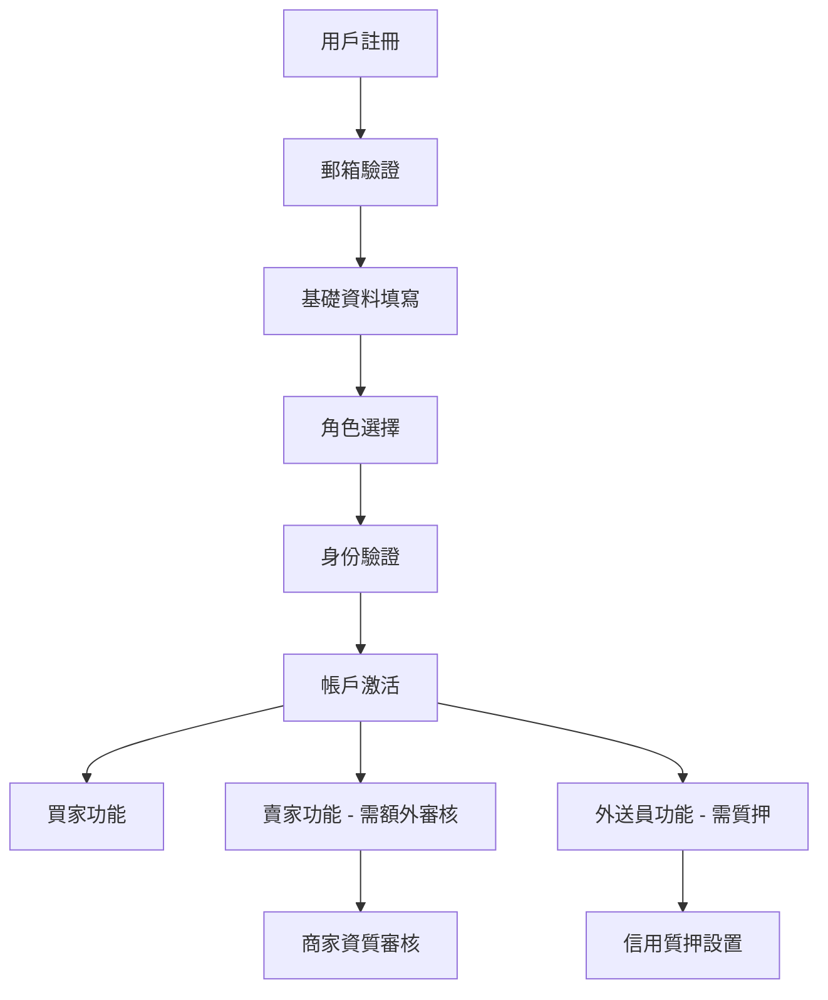
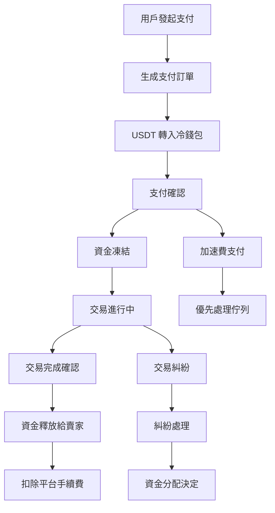
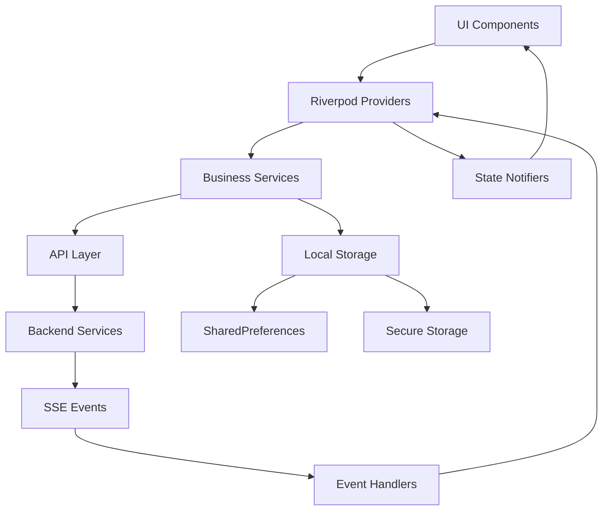

# AgoraMarket - 架構與業務介紹文檔
## 測試團隊專用版本

---

## 📋 目錄
1. [項目概述](#項目概述)
2. [技術架構](#技術架構)
3. [業務模式](#業務模式)
4. [核心功能模組](#核心功能模組)
5. [用戶角色與權限](#用戶角色與權限)
6. [業務流程](#業務流程)
7. [API 架構](#api-架構)
8. [數據流向](#數據流向)
9. [測試重點領域](#測試重點領域)
10. [環境配置](#環境配置)

---

## 🎯 項目概述

**AgoraMarket** 是一個創新的去中心化 C2C（消費者對消費者）交易平台，允許用戶自由切換買家、賣家、外送員三個角色，通過 USDT 支付進行商品與服務交易。

### 核心特色
- **多角色切換**：用戶可同時擔任買家、賣家、外送員
- **去中心化支付**：使用 USDT 加密貨幣進行交易
- **智能配送**：基於地理位置的配送員匹配系統
- **信用質押**：通過質押機制提升平台信任度
- **冷錢包託管**：確保資金安全的代收代付機制

### 技術規格
- **前端框架**：Flutter 3.0+ (Web 優先，支援跨平台)
- **開發語言**：Dart
- **版本**：1.0.121+121
- **主要平台**：Web (Chrome, Firefox, Safari)
- **未來支援**：Android, iOS

---

## 🏗️ 技術架構

### 整體架構設計
```
┌─────────────────────────────────────────────────────────────┐
│                    Flutter Web Frontend                     │
├─────────────────────────────────────────────────────────────┤
│  Presentation Layer (UI Components & State Management)     │
│  ├── Features (admin, cart, chat, order, wallet, etc.)    │
│  ├── Core UI Kit (Components, Themes, Styles)             │
│  └── Widgets (Reusable UI Components)                     │
├─────────────────────────────────────────────────────────────┤
│  Business Logic Layer                                      │
│  ├── Services (Auth, Payment, Location, etc.)             │
│  ├── State Management (Riverpod + Provider)               │
│  └── Domain Models                                         │
├─────────────────────────────────────────────────────────────┤
│  Data Layer                                                │
│  ├── API Integration (agora_market_dart_sdk)               │
│  ├── Local Storage (SharedPreferences, SecureStorage)     │
│  └── Real-time Communication (SSE)                        │
├─────────────────────────────────────────────────────────────┤
│  Infrastructure Layer                                      │
│  ├── Network (Dio HTTP Client)                            │
│  ├── Authentication (JWT Tokens)                          │
│  ├── Error Handling (Global Error Handler)               │
│  └── Dependency Injection (GetIt + Injectable)           │
└─────────────────────────────────────────────────────────────┘
```

### 核心技術棧

#### 前端技術
- **Flutter 3.0+**: 跨平台 UI 框架
- **Dart**: 主要開發語言
- **Riverpod**: 狀態管理（主要）
- **Provider**: 狀態管理（輔助）
- **Auto Route**: 路由管理
- **GetIt + Injectable**: 依賴注入

#### 網絡與通信
- **Dio**: HTTP 客戶端
- **agora_market_dart_sdk**: 自定義 API SDK
- **Server-Sent Events (SSE)**: 實時通信
- **Web3dart**: 區塊鏈交互

#### 數據存儲
- **SharedPreferences**: 本地偏好設置
- **Flutter Secure Storage**: 敏感數據存儲
- **SQLite**: 本地數據庫

#### 地圖與位置
- **Google Maps Flutter**: 地圖服務
- **Geolocator**: 位置服務
- **Geocoding**: 地址編碼

#### UI 與體驗
- **Cached Network Image**: 圖片緩存
- **Flutter SVG**: SVG 圖片支持
- **File Picker**: 文件選擇
- **Image Picker**: 圖片選擇

---

## 💼 業務模式

### 平台定位
**去中心化 C2C 交易生態系統**，連接買家、賣家、外送員三方，創造無縫協作的交易環境。

### 盈利模式
1. **交易手續費**：每筆交易收取一定比例手續費
2. **加速費**：用戶可支付額外費用加速交易處理
3. **質押收益**：信用質押資金的投資收益分成
4. **增值服務**：高級商家認證、廣告推廣等

### 核心價值主張
- **安全可靠**：冷錢包託管 + 智能合約
- **高效便捷**：智能匹配 + 實時追蹤
- **公平透明**：去中心化治理 + 信用評價
- **靈活多元**：多角色切換 + 多樣化服務

---

## 🎭 用戶角色與權限

### 1. 買家 (Buyer)
**主要功能**：
- 瀏覽商品與服務（包括跑腿服務）
- 基於地理位置的智能商品推薦
- USDT 支付與交易加速
- 訂單狀態追蹤與配送監控
- 商品評價與申訴

**權限級別**：基礎用戶
**測試重點**：商品搜索、下單流程、支付安全、物流追蹤

### 2. 賣家 (Seller)
**主要功能**：
- 商品上架與管理
- 訂單處理與狀態更新
- 外送員協作對接
- 收入統計與分析
- 信用等級管理

**權限級別**：商家用戶
**測試重點**：商品管理、訂單處理、收款流程、數據統計

### 3. 外送員 (Delivery)
**主要功能**：
- 跑腿服務上架
- 智能訂單接收與匹配
- 路線規劃與導航整合
- 收入統計與提現
- 信用質押管理

**權限級別**：服務提供者
**測試重點**：服務管理、訂單匹配、導航功能、收入結算

### 4. 管理員 (Admin)
**主要功能**：
- 用戶管理與審核
- 商品審核與管理
- 交易監控與糾紛處理
- 系統配置與統計
- 財務管理

**權限級別**：超級管理員
**測試重點**：管理界面、數據準確性、權限控制、系統穩定性

---

## 🔄 業務流程

### 核心交易流程



### 用戶註冊與認證流程



### 支付與結算流程



---

## 🧩 核心功能模組

### 1. 認證系統 (Authentication)
**位置**: `lib/core/auth/`
**功能**:
- 用戶註冊、登錄、密碼重置
- JWT Token 管理與自動刷新
- 多因素認證（郵箱驗證碼）
- SSE 連接認證

**測試要點**:
- 登錄安全性
- Token 過期處理
- 密碼強度驗證
- 驗證碼時效性

### 2. 商品管理 (Product)
**位置**: `lib/features/product/`
**功能**:
- 商品上架、編輯、下架
- 多圖片上傳與管理
- 商品分類與搜索
- 庫存管理
- 價格設定

**測試要點**:
- 圖片上傳穩定性
- 搜索準確性
- 庫存同步
- 價格計算正確性

### 3. 訂單系統 (Order)
**位置**: `lib/features/order/`
**功能**:
- 訂單創建與管理
- 狀態追蹤與更新
- 配送信息管理
- 訂單取消與退款

**測試要點**:
- 訂單狀態同步
- 配送信息準確性
- 取消退款流程
- 併發訂單處理

### 4. 錢包系統 (Wallet)
**位置**: `lib/features/wallet/`
**功能**:
- USDT 餘額管理
- 充值與提現
- 交易記錄查詢
- 質押金管理

**測試要點**:
- 餘額計算準確性
- 交易記錄完整性
- 充值提現安全性
- 質押解質押流程

### 5. 聊天系統 (Chat)
**位置**: `lib/features/chat/`
**功能**:
- 實時消息傳送
- 圖片分享
- 消息歷史記錄
- 多方會話管理

**測試要點**:
- 消息即時性
- 圖片傳輸穩定性
- 消息順序正確性
- 離線消息處理

### 6. 配送系統 (Delivery)
**位置**: `lib/features/delivery_home/`
**功能**:
- 外送員服務管理
- 訂單匹配算法
- 路線規劃與導航
- 收入統計

**測試要點**:
- 匹配算法準確性
- 導航功能整合
- 收入計算正確性
- 服務區域限制

### 7. 管理後台 (Admin)
**位置**: `lib/features/admin/`
**功能**:
- 用戶管理
- 商品審核
- 訂單監控
- 系統統計
- 糾紛處理

**測試要點**:
- 權限控制嚴格性
- 數據統計準確性
- 批量操作穩定性
- 審核流程完整性

---

## 🔗 API 架構

### API SDK 整合
**主要SDK**: `agora_market_dart_sdk`
- 自定義 API 客戶端
- 自動生成的 API 接口
- 統一的錯誤處理
- 自動重試機制

### 主要 API 服務類

#### 認證相關
- `AuthApi`: 用戶認證
- `UserPreferences`: 用戶偏好設置

#### 業務功能
- `ProductsApi`: 商品管理
- `MemberOrdersApi`: 訂單管理
- `DefaultApi`: 通用功能
- `AdminProductsApi`: 管理員商品操作

#### 文件管理
- `FileManagementApi`: 文件上傳下載
- `FileUploadService`: 文件上傳服務

### 實時通信
**SSE 服務**: `lib/core/services/sse_service.dart`
- 服務器推送事件
- 自動重連機制
- 心跳檢測
- 消息緩衝處理

**支援事件類型**:
- `CHAT_MESSAGE`: 聊天消息
- `ORDER_UPDATE`: 訂單更新
- `WALLET_UPDATE`: 錢包更新
- `NOTIFICATION`: 系統通知

---

## 📊 數據流向

### 狀態管理架構



### 數據持久化
1. **用戶偏好**: SharedPreferences
2. **敏感數據**: Flutter Secure Storage
3. **緩存數據**: 內存緩存 + 本地存儲
4. **實時數據**: SSE 推送更新

### 錯誤處理機制
- **全局錯誤處理器**: `GlobalErrorHandler`
- **API 錯誤攔截**: `DioAuthInterceptor`
- **網絡錯誤重試**: 自動重試機制
- **用戶友好提示**: 統一錯誤消息格式

---

## 🧪 測試重點領域

### 1. 功能測試重點

#### 用戶認證
- [ ] 註冊流程完整性
- [ ] 登錄安全性驗證
- [ ] 密碼重置功能
- [ ] Token 自動刷新
- [ ] 多設備登錄處理

#### 商品管理
- [ ] 商品上架流程
- [ ] 圖片上傳穩定性
- [ ] 搜索功能準確性
- [ ] 分類篩選正確性
- [ ] 庫存同步機制

#### 交易流程
- [ ] 下單流程完整性
- [ ] 支付安全性
- [ ] 訂單狀態同步
- [ ] 退款流程
- [ ] 評價系統

#### 配送功能
- [ ] 外送員匹配算法
- [ ] 實時位置追蹤
- [ ] 導航功能整合
- [ ] 配送狀態更新

### 2. 性能測試重點

#### 前端性能
- [ ] 頁面載入速度
- [ ] 圖片載入優化
- [ ] 內存使用效率
- [ ] 網絡請求優化

#### 併發處理
- [ ] 多用戶同時下單
- [ ] 高併發支付處理
- [ ] 實時消息處理
- [ ] 數據庫併發訪問

### 3. 安全測試重點

#### 認證安全
- [ ] JWT Token 安全性
- [ ] 密碼加密存儲
- [ ] 會話管理安全
- [ ] API 權限驗證

#### 交易安全
- [ ] 支付數據加密
- [ ] 資金安全保障
- [ ] 交易記錄完整性
- [ ] 防重複支付

### 4. 兼容性測試

#### 瀏覽器兼容
- [ ] Chrome (主要支援)
- [ ] Firefox
- [ ] Safari
- [ ] Edge

#### 響應式設計
- [ ] 桌面端 (1920x1080)
- [ ] 平板端 (768x1024)
- [ ] 手機端 (375x667)

---

## ⚙️ 環境配置

### 開發環境要求
```yaml
# Flutter 版本
Flutter: ">=3.0.0 <4.0.0"
Dart: ">=3.0.0 <4.0.0"

# Node.js (用於依賴管理)
Node.js: ">=16.0.0"

# 瀏覽器要求
Chrome: ">=90.0"
Firefox: ">=88.0"
Safari: ">=14.0"
```

### 環境變數配置
```env
# API 配置
API_BASE_URL=https://api.agoramarket.com
API_TIMEOUT=30000

# 區塊鏈配置
BLOCKCHAIN_NETWORK=mainnet
USDT_CONTRACT_ADDRESS=0x...

# 地圖服務
GOOGLE_MAPS_API_KEY=your_google_maps_api_key

# 推送通知
FCM_SERVER_KEY=your_fcm_server_key
```

### 測試環境設置

#### 本地開發
```bash
# 安裝依賴
flutter pub get

# 運行開發服務器
flutter run -d chrome

# 運行測試
flutter test
```

#### 生產構建
```bash
# 構建 Web 版本
flutter build web --release

# 部署到服務器
# 將 build/web 目錄內容上傳到 Web 服務器
```

### 測試數據準備

#### 測試用戶帳號
- **買家測試帳號**: buyer_test@example.com
- **賣家測試帳號**: seller_test@example.com
- **外送員測試帳號**: delivery_test@example.com
- **管理員測試帳號**: admin_test@example.com

#### 測試商品數據
- 各類別測試商品
- 不同價格區間商品
- 多圖片商品
- 缺貨商品

#### 測試交易數據
- 正常交易流程
- 異常交易情況
- 退款申請案例
- 糾紛處理案例

---

## 📝 測試建議

### 測試策略
1. **自動化測試優先**: 對核心業務流程實施自動化測試
2. **端到端測試**: 覆蓋完整的用戶旅程
3. **API 測試**: 確保後端接口穩定性
4. **性能監控**: 持續監控關鍵性能指標
5. **安全審計**: 定期進行安全漏洞掃描

### 測試工具推薦
- **單元測試**: Flutter Test Framework
- **整合測試**: Flutter Integration Test
- **E2E 測試**: Playwright (從測試目錄結構看)
- **API 測試**: Postman/Newman
- **性能測試**: Lighthouse, WebPageTest
- **安全測試**: OWASP ZAP

### 關鍵測試場景
1. **用戶註冊到首次購買**的完整流程
2. **賣家從商品上架到收款**的完整流程
3. **外送員從接單到完成配送**的完整流程
4. **異常情況處理**：網絡中斷、支付失敗、配送異常
5. **高併發場景**：多用戶同時操作相同商品

---

## 🔍 故障排除指南

### 常見問題與解決方案

#### 1. SSE 連接問題
**症狀**: 實時消息無法接收
**排查步驟**:
- 檢查網絡連接狀態
- 驗證 JWT Token 有效性
- 查看瀏覽器控制台錯誤
- 檢查 SSE 服務狀態

#### 2. 支付流程異常
**症狀**: 支付無法完成或狀態不更新
**排查步驟**:
- 檢查 USDT 錢包餘額
- 驗證冷錢包地址正確性
- 查看交易記錄
- 檢查區塊鏈網絡狀態

#### 3. 圖片上傳失敗
**症狀**: 商品圖片無法上傳
**排查步驟**:
- 檢查圖片格式和大小限制
- 驗證文件上傳服務狀態
- 查看網絡帶寬
- 檢查存儲空間

#### 4. 地圖功能異常
**症狀**: 地圖無法載入或定位不準確
**排查步驟**:
- 檢查 Google Maps API Key
- 驗證地理位置權限
- 查看網絡連接
- 檢查 API 配額使用情況

---

## 📞 技術支援聯繫方式

**開發團隊聯繫方式**:
- **專案維護者**: Redan
- **技術文檔**: 本文檔及代碼註釋
- **問題回報**: 通過項目 Issue 系統
- **緊急聯繫**: 通過團隊內部通訊渠道

**測試環境訪問**:
- **測試環境 URL**: https://redandan.github.io/#/login
- **API 文檔**: https://api-docs.agoramarket.com

---

*最後更新時間: 2025年1月*
*文檔版本: v1.0*
*對應代碼版本: 1.0.121+121*
